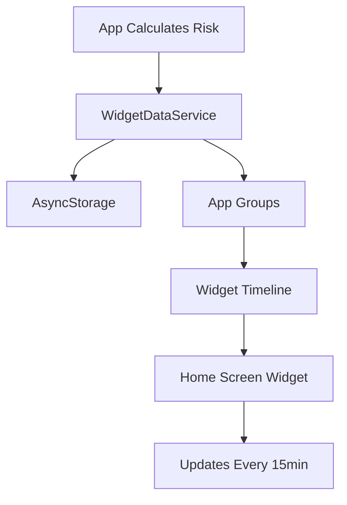

# Widget Preview & Quick Start

## 🎨 Widget Designs

### Small Widget (2x2)
```
┌─────────────────┐
│  Migraine Risk  │
│                 │
│    ┌─────┐     │
│   ╱  65%  ╲    │
│  │  High   │   │
│   ╲_______╱    │
│                 │
│   5m ago        │
└─────────────────┘
```
Perfect for: Quick glance at risk level

---

### Medium Widget (4x2)
```
┌─────────────────────────────────────┐
│  Risk  │  Active Triggers           │
│        │  • Stress                  │
│  ┌─┐   │  • Poor Sleep              │
│ │65%│  │  • Weather                 │
│ │Hi │  │                            │
│  └─┘   │  ❤️ 78  📊 32              │
│        │  5m ago                    │
└─────────────────────────────────────┘
```
Perfect for: Risk + top triggers overview

---

### Large Widget (4x4)
```
┌──────────────────────────────────────┐
│  Migraine Risk Index     🧠  5m ago  │
│                                      │
│           ┌───────────┐              │
│          ╱     65%     ╲             │
│         │     High      │            │
│          ╲____________╱              │
│                                      │
│  Active Triggers                     │
│  • Stress                            │
│  • Poor Sleep                        │
│  • Weather Change                    │
│                                      │
│  Today's Metrics                     │
│  ┌────┐  ┌────┐  ┌────┐             │
│  │ 78 │  │ 32 │  │65% │             │
│  │ HR │  │HRV │  │SLP │             │
│  └────┘  └────┘  └────┘             │
└──────────────────────────────────────┘
```
Perfect for: Complete health overview

---

## 🚀 Quick Start (5 Minutes)

### Step 1: Run Prebuild
```bash
cd client
npx expo prebuild
```

### Step 2: Open in Xcode
```bash
cd ios
open *.xcworkspace
```

### Step 3: Add Widget Target
1. File → New → Target
2. Search "Widget Extension"
3. Name it `MigraineWidget`
4. Click Activate when prompted

### Step 4: Add Widget Code
1. Delete default `MigraineWidget.swift`
2. Drag `WIDGET_CODE/MigraineWidget.swift` into widget folder
3. Check "Copy items if needed"

### Step 5: Add App Groups
**Main App:**
1. Select app target
2. Signing & Capabilities
3. + Capability → App Groups
4. Add: `group.com.phizerjunction.migraine`

**Widget:**
1. Select MigraineWidget target
2. Repeat steps above
3. Use same group ID

### Step 6: Build & Run
1. Select MigraineWidget scheme
2. Choose device/simulator
3. Click Run ▶️
4. Widget appears in gallery!

---

## 📱 How to Add Widget to Home Screen

1. **Long-press** empty space on home screen
2. Tap **+** button (top left corner)
3. Search for **"Migraine Risk"**
4. Choose size: Small / Medium / Large
5. Tap **Add Widget**
6. Drag to position
7. Tap **Done**

---

## 🎯 What Gets Displayed

| Data Point | Source | Update Frequency |
|------------|--------|------------------|
| Risk % | Calculated in app | Real-time |
| Risk Level | Low/Moderate/High/Very High | Real-time |
| Heart Rate | Apple Health / Wearable | Every 5 seconds |
| HRV | Apple Health / Wearable | Every 5 seconds |
| Sleep | Sleep tracking | Daily |
| Triggers | Environmental sensors | Real-time |
| Last Update | Timestamp | Every update |

---

## 💡 Widget Behavior

### Auto-Refresh Schedule:
- **App Open**: Immediate update
- **Background**: Every 15 minutes
- **Data Change**: When risk changes ≥5%

### Battery Impact:
- ✅ **Minimal**: Uses system widget timeline
- ✅ **Optimized**: Only updates when needed
- ✅ **Efficient**: Shared app group reduces overhead

### Data Persistence:
- ✅ Widget survives app closure
- ✅ Data persists through restarts
- ✅ Graceful fallback to placeholder

---

## 🔧 Customization Options

### Change Colors
Edit `MigraineWidget.swift` line 410:
```swift
func getRiskColor(_ percentage: Int) -> String {
    if percentage < 30 { return "#10B981" }  // Green
    if percentage < 50 { return "#F59E0B" }  // Yellow
    if percentage < 70 { return "#F97316" }  // Orange
    return "#EF4444"                          // Red
}
```

### Change Refresh Interval
Edit `MigraineWidget.swift` line 45:
```swift
let nextUpdate = Calendar.current.date(
    byAdding: .minute,
    value: 15,  // Change this (minimum 15)
    to: currentDate
)!
```

### Show Different Metrics
Edit `widgetDataService.ts`:
```typescript
todayMetrics: {
    heartRate: metrics.heartRate,
    hrv: metrics.hrv,
    stress: metrics.stress,     // Add this
    steps: metrics.steps,        // Or this
    sleep: metrics.sleepQuality,
}
```

---

## ✅ Testing Checklist

Before deployment:
- [ ] Widget appears in widget gallery
- [ ] Small widget shows risk %
- [ ] Medium widget shows triggers
- [ ] Large widget shows all metrics
- [ ] Colors match risk level (green/yellow/orange/red)
- [ ] Time updates correctly
- [ ] Widget refreshes when app opens
- [ ] Widget works after closing app
- [ ] Multiple sizes work simultaneously

---

## 🐛 Common Issues

### "Widget not found in gallery"
**Fix**: Select widget scheme and run again

### "No data showing"
**Fix**: Open main app, wait for risk calculation

### "Widget shows old data"
**Fix**: Remove widget, re-add to home screen

### "Build failed"
**Fix**: Clean build folder (Cmd+Shift+K), rebuild

---

## 📊 Widget Data Flow



---

## 🎨 Design Philosophy

### Glanceable
- Large, bold numbers
- Color-coded risk levels
- Minimal text

### Informative
- Shows what matters: Risk %
- Top triggers at a glance
- Key health metrics

### Consistent
- Matches app design
- Same color scheme
- Familiar iconography

---

## 🚀 Future Enhancements

Ideas for v2:
- [ ] Interactive buttons (tap to log migraine)
- [ ] Lock screen widgets
- [ ] Live Activities on Dynamic Island
- [ ] Configurable metrics
- [ ] Multiple widget variants (HR-focused, Trigger-focused)
- [ ] Complications for Apple Watch

---

## 📚 Learn More

- [Full Setup Guide](./WIDGET_SETUP.md)
- [WidgetKit Docs](https://developer.apple.com/documentation/widgetkit)
- [SwiftUI Basics](https://developer.apple.com/tutorials/swiftui)

---

**Ready to go?** Follow Quick Start above! ⬆️

Questions? Check [WIDGET_SETUP.md](./WIDGET_SETUP.md) for detailed troubleshooting.
